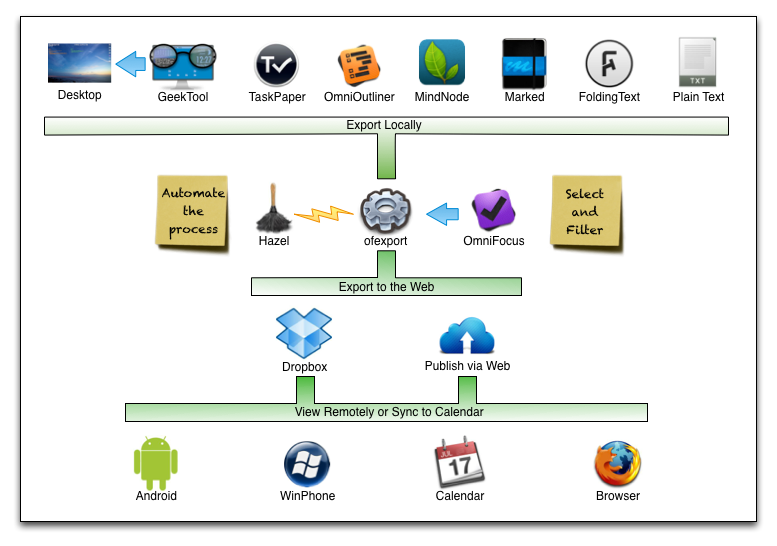
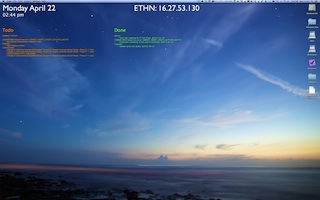
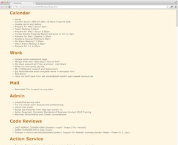
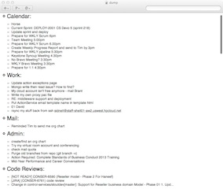
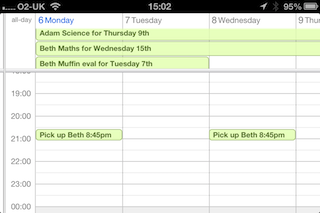

# ofexport #

Export specific items from OmniFocus and do... stuff.

- [Changelog](https://github.com/psidnell/ofexport/blob/master/CHANGELOG.md)

Avenues for help/abuse:

- [Wiki](https://github.com/psidnell/ofexport/wiki)
- [Bugs](https://github.com/psidnell/ofexport/issues)
- [Blog: Poor Signal](http://poor-signal.blogspot.co.uk)
- [Twitter: @psidnell](http://twitter.com/psidnell)

Related Applications:

- [OmniFocus](http://www.omnigroup.com/products/omnifocus/)
- [OmniFocus Extras **ofexport** Forum Thread](http://forums.omnigroup.com/showthread.php?t=29081)
- [Taskpaper](http://www.hogbaysoftware.com/products/taskpaper)
- [TaskPaper **ofexport** Forum Thread](https://groups.google.com/forum/?fromgroups=#!topic/taskpaper/7xQ4lE_1O9I)
- [Hazel](http://www.noodlesoft.com/hazel.php)
- [Dropbox](http://www.dropbox.com)
- [GeekTool](http://projects.tynsoe.org/en/geektool/)

## Overview:

**ofexport** is a command line utility that reads and exports the task database from the OmniFocus application.

For example:

        ofexport -a=Work -a "completed='last week'" -o ~/Desktop/doc.taskpaper --open

will produce a TaskPaper document on your desktop containing all items completed this week related to "Work" and open it (if you have TaskPaper installed).

There's a [list of usage examples here](documentation/examples.md) if you're not the kind of person to read instructions.

### Example Uses ###

- Generating project/time specific reports.
- Creating web content.
- Exporting key tasks to devices/OSs that don't support OmniFocus via Dropbox.
- Backing up the OmniFocus database to a form searchable by other tools.
- Automatically creating reports on demand with Hazel whenever OmniFocus writes its database.
- Display todays tasks on the desktop with GeekTool.
- Adding selected tasks to your calendar.

Rendered on the Desktop (using GeekTool)

Web Page

TaskPaper Document

Calendar

### Features

**Export to a number of text based file formats:**

- TaskPaper
- Plain Text
- Markdown/FoldingText
- OPML (Can be read by OmniOutliner, various MindMap tools)
- HTML
- ICS (Can be subscribed to via the Calendar app)
- Modify the existing format templates or create new ones.

**Filter what gets exported:**

- Include/exclude tasks, projects and folders with text searches (regular/logical expressions)
- Include/exclude tasks and projects by flag state.
- Include/exclude, tasks and projects by start/completion/due date.

**Restructure the data:**

- Flatten the outport document to create a simpler document (just projects containing tasks).
- Sort tasks by date or text.
- Eliminate empty projects/folders.
- Organise by project or context hierarchy.

**Open**

- **ofexport** is built on a re-useable python library.
- You can use this in your own tools.
- The code is licenced under the [Apache License](http://opensource.org/licenses/Apache-2.0).

### Limitations ###

Given that **ofexport** is using a completely undocumented and unsupported means of accessing the OmniFocus database, there are inevitably some shortcomings. The tool doesn't load all the metadata you might expect from the OmniFocus database such as:

- Context Status (I don't know where it's in the database yet)
- Project Type/Status (I don't know they're stored is in the database yet)

However I wrote this tool primarily for my own use and while I'm using it on a daily basis it's going to be pretty well supported.

I plan to upgrade to OmniFocus 2 when it's ready and hope to ensure compatibility before it's released.

### OBLIGATORY WARNINGS ###

- If you don't know what a bash script is, have never used the command line or don't know why **rm -rf** are the scariest 6 characters in the kingdom then reading on is probably just going to give you a headache or worse.
- If Omni change the format of their database in a future update then **ofexport** will need to be fixed.
- This program reads your OmniFocus database file directly. While it should be impossible (as written) for it to modify or delete that database, set fire to your Mac, empty your bank accounts or knock the earth out of orbit - bugs happen. But you obviously have backups - right?  

## Pre-requisites

- This code was written on OS X 10.8 (Mountain Lion) which ships with python 2.7.2.
- It may work on OS X 10.7 (Lion) which ships with python 2.7.1 but I haven't had the chance to test it (let me know if there are problems). 
- It definitely won't work on OS X 10.6 (Snow Leopard) which ships with python 2.6.1 by default.
- However it's possible upgrade to newer versions of python [here](http://www.python.org/download/releases/). 
- I've tested ofexport against OmniFocus 1.10.4 - the current release at the time of writing.

## Download/Installation

This pre-supposes a certain familiarity with the command line.

There are two ways to fetch the project:

**Direct Download**

1. Download the [zip file](https://github.com/psidnell/ofexport/archive/master.zip).
2. Double click on the zip file to unpack it.
3. Move the **ofexport** folder to wherever you want it to live.
4. In terminal change directory to the install location.
5. Run **bash install.sh** and follow the instructions.

**Clone the git repository**

1. Type **git clone https://github.com/psidnell/ofexport.git**
2. cd into the **ofexport** folder.
3. Run **bash install.sh** and follow the instructions.

It's recommended that you re-run **bash install.sh**  after pulling updates.

## Tutorial:
		
To get help on usage and the full list of options, run the command as follows:

        ofexport -?

The most simple example of usage is:

        ofexport -o report.txt

This produces a not particularly useful and possibly huge text file (report.txt) of your entire task database.

To get useful data out we want to start using more structured file formats and filters.

### File Formats:

The format of the report file is controlled by the suffix of the output file. So by running:

        ofexport -o report.txt

you'll get a text file. By changing the suffix you'll get different formats:

- **Plain Text:** .txt or .text
- **Markdown**: .md or .markdown
- **FoldingText:** .ft or .foldingtext (same as Markdown)
- **TaskPaper:** .tp or .taskpaper
- **OPML:** .opml
- **HTML:** .html or .htm		
- **Calendar:** .ics	 

### Project or Context Mode ###

By default tasks are organised by project. By selecting **-C** the tool will instead organise by context. Usage of **-P** and **-C** can be used between filters to change the nature of the filtering. Whichever mode the tool is in at the end of the filtering dictates whether project or context mode is used to format the output.

### Filters

Filters are a powerful way of controlling the content or structure of your report.

Filters are run in one of two modes: **include** and **exclude**. By default the tool is in **include** mode but by using the **-I** and **-E** options you can flip from one mode to the other and back. 

We'll be referring to the following structure:

    Folder: Home
        Project: Cat
                Task: Feed the cat junk
                Task: Train Tiddles to juggle
    Folder Work
        Project: Mail
                Task: Send receipts
                Task: Purge junk
 
#### Including

For example: **-I -t=Work** - include any task with "Work" in it's text.

When an include filter matches an item then it (and it's descendants, and all items to the root) will appear in the report. All other items will be eliminated.

If you ran an include filter searching for "Work" you'd get:

    Folder Work
        Project: Mail
                Task: Send receipts
                Task: Purge junk

If you ran a filter searching for "junk" you'd get:

    Folder: Home
        Project: Cat
                Task: Feed the cat junk
    Folder Work
        Project: Mail
                Task: Purge junk

If you ran a filter searching for "Cat" you'd get:

    Folder: Home
        Project: Cat
                Task: Feed the cat junk
                Task: Train Tiddles to juggle
 
#### Excluding ####

For example: **-E -t=junk** - exclude any task with "junk" in it's text.

When an exclude filter matches an item then it (and it's descendants) will not appear in the report. All other items will be retained.

If you ran an exclude filter searching for 'junk' you'd get:

    Folder: Home
        Project: Cat
                Task: Train Tiddles to juggle
    Folder Work
        Project: Mail
                Task: Send receipts
 
If you ran an exclude filter searching for ''Cat" you'd get:

    Folder: Home
    Folder Work
        Project: Mail
                Task: Send receipts
                Task: Purge junk

#### Sorting

To sort items its possible to use a sort filter e.g. **-p "sort due"** which will sort the contents of all projects by their due date  (if they have one), or **-p "sort text"** which sorts alphabetically.

The directive **-p sort** has the same effect as **-p sort text**.

Note that when we sort any type, it's the direct descendants of any nodes of that type that get sorted, so if you sorted Folders alphabetically with **-f sort**, it's the folders/projects within them that get sorted.

#### Pruning ####

You might run a filter that eliminates a lot of tasks and leaves a lot of empty projects or folders in your report. If you don't want to see these then use the prune option.

It's possible to run a pruning filter: e.g. **-a prune** that can remove any folders, projects or contexts that have no tasks within them.

#### Flattening

If the report is flattened e.g. with **-a flatten** then all sub-folders, sub-context, sub-tasks are pulled up to to their parents level leaving a more readable document with a flattened hierarchy. Using the flatten filter on all node types will result in a document that simply has projects/contexts with a single level of tasks beneath.

#### Multiple Filters

The important thing to note about filters is that you can specify as many as you like and they are executed in the order you specify. If there are multiple filters then the output of one is passed to the next and so on.

So you might start by including only your work folder, then exclude any project with "Routine" in the title, then include only items completed today.

It's possible to create quite sophisticated queries on your OmniFocus database by using a series of includes, excludes and regular expressions but even without an in-depth knowledge of what a regular expressions is, it's possible to achieve white a lot.

It's possible to change between project and context mode by adding **-P** or **-C** between filters or between import and export mode by adding **-I** or **-E**. The tools's final mode dictates how the report is printed. It's also possible to run all the filters in project mode and flip to context mode just for the output or vice versa. 

#### Filtering with Expressions

The filters we've seen so far have been quite straight forward, but it's possible to use general boolean expressions:

- (type=Task or type=Project) and name=Work
- name!='Regular Repeat' and due=today
- (flagged or due='today to fri') and start='from today'

See later for the full list of attributes and expression syntax.

The filter **-t=xxx** actually gets expanded to **-t (type=Task)and(name=xxx)** 

#### Spaces and Quotes

The bash shell can make things complicated when there are spaces or quotes in an argument and the expression must still make sense when ofexport finally gets it.

**-t name=Fred** works fine

**-t "name='Fred Blogs'"** needs the double quotes to stop bash chopping the expression on the space and the single are needed to tell ofexport that it's **Fred Blogs** that you're looking for not **Fred**

**-t 'name="Fred Blogs"'** will work.

If you need need to search for a quote you'll need some horrific expression like this:

**-a 'name="\""'** 

#### Filtering with Dates

For example **-t due=today** or **-t 'start="next week"'**

A specific day can be expressed as:

- "Monday" - the monday that occurs within this week.
- "th" - Days of the week can be abbreviated down to 2 characters.
- "yesterday", "today",  "tomorrow"
- "last tuesday" - the Tuesday that occurs in the previous week.
- "next sat" - the Saturday that occurs in the next week.
- "2013-04-09"

A range of dates can be expressed as:

- "July", "jul" - every day in July of this year.
- "to 2013-05-10" - everything on or before the date.
- "from yesterday" - everything on or after yesterday.
- "yesterday to 2014-10-01" everything between the two days
- "this week" - everything from this Monday to this Sunday.
- "next week"
- "last week"
- "next July"
- "none" or "" - only matches items with no date
- "any" - only matches items with a date

####  Attributes for filtering and sorting ####

There are several different attributes, each of which may have alternatives for convenience:

- **type** - must be one of *Project*, *Context*, *Task*, *Folder*.
- **title** - alternatives: text, name.
- **start** - alternatives: started, begin, began.
- **done** - alternatives: end, ended, complete, completed, finish, finished, completion.
- **due** - alternatives: deadline.
- **flag** - alternatives: flagged.
- **next** - true for a task if it's the next task in it's project.
- **status** - The status of a project/context, must be one of *active*, *inactive*, *dropped*, *done* (*done/dropped* only apply to projects).
- **note** - the text of the attached note.

#### Templates - a Brief Overview####

The format for each file type is by default determined by the output file name extension. By looking in the templates directory you will see a number of files with names like **text.json** etc. These are the [json](http://en.wikipedia.org/wiki/JSON) formatting templates the tool uses for the built in supported file formats. By using the **-T template_name** option (e.g. **-T text**) the tool will use the nominated template instead of the default one. You can modify the existing templates or create new ones to suit your needs.

For example, this is the current text template:

	{
		"indent": 0, 
		"depth" : 0, 
		"Nodes": {
			"ProjectStart": "${indent}Project: $name $flagged$date_to_start$date_due$date_completed$context$project", 
			"FolderStart": "${indent}Folder $name", 
			"TaskStart": "${indent}Task $name $flagged$date_to_start$date_due$date_completed$context$project", 
			"TaskGroupStart": "${indent}TaskGroup $name $flagged$date_to_start$date_due$date_completed$context$project", 
			"ContextStart": "${indent}Context $name"
		}, 
		"NodeAttributeDefaults": {
			"date_to_start": "", 
			"date_due": "", 
			"date_completed": "", 
			"link" : "",
			"name": "", 
			"project": "", 
			"context": "", 
			"flagged": ""
		}, 
		"indentString": "    ", 
		"NodeAttributes": {
			"date_to_start": " start:$value", 
			"date_due": " due:$value", 
			"date_completed": " done:$value", 
			"link": "$value", 
			"name": "$value", 
			"project": " project:$value", 
			"context": " context:$value", 
			"flagged": " flagged"
		}
	}

* **indent** : The indent level the document formatting starts at. Usually 0 but for formats that have a preamble (like xml or html) you might want to increase this to improve the layout.
* **depth** : This sets the initial value of a variable you can refer to in the template that tracks the indent depth. For example in html you might set this to start at 1 and then use **\<H$depth>$name\</H$depth>** for formatting folders.
* **nodes**: This contains sections for formatting lines for each node type. You can optionally have an XStart and/or XEnd where X is Folder, Project, Task or Context. The contents of each entry contain references to symbolic values that will be populated from the document. 
* **NodeAttributeDefaults**: This lists all the attribute types and what values that have if they do not occur in the line being formatted. Usually they're empty by you might want "not due" or "unflagged" etc.
* **indentString**: This is the set of characters used to indent the document, usually a few spaces or a tab **"\t"**. The $indent variable will contain N occurrences of this where N is the depth of the item in the document.
* **NodeAttributes**: This section lists all the attributes available for use in the line and allows a different formatting for each. For example if the document is HTML you might wish to represent a due date in bold: **"\<b>$value\</b>"**
* **preamble/postamble**: Some text to print at the start/end of the document.
* **preambleFile/postambleFile**: A file to include at the start/end of the document. This is useful for including things like an HTML header that incorporates a sizeable style sheet.

Browsing the existing templates, making copies and experimenting is probably the best way to start - but beware: json is an unforgiving format and errors that result from a missing  coma or quote are "not towards the helpful end of the spectrum".

### Calendar Export

When an ics file is exported then any Project/Task items in the report (with limitations) be included in the calendar file. The format of an entry in an ics file demands that an item has a start and end time whereas an OmniFocus task does not have this restriction, therefore there are some simple rules that ofexport uses to satisfy this constraint:

- If an item has a start and due time, then these are used as-is.
- If an item has only a start or a due then this one date is used for both.
- If an item has neither a start or a due then it will not appear in the calendar.

In addition there is some control that can be exerted over how an item is exported. If certain text appears on a line in the OmniFocus note then this modifies how the item will appear in the calendar. The **%of cal ...** string is used for this purpose - the options are:

- **%of cal onstart** The item will appear at the OmniFocus start time in the exported calendar.
- **%of cal ondue** The item will appear at the OmniFocus due time in the exported calendar.
- **%of cal allday** The item will appear as an all day event from it's start day to it's due day.
- **%of cal noalarm** The item will not have an associated alarm.
- **%of cal start=HH:MM** The item will appear in the calendar starting at HH:MM (24hr format).
- **%of cal due=HH:MM** The item will appear in the calendar finishing at HH:MM (24hr format).

It's possible to combine this into a single line:

        %of cal start=11:00 due=14:00 noalarm

Note: all items have an alarm set at the start time by default, but these can be stripped when subscribing with the Calendar app. The Calendar app can only subscribe to calendar files available via an http url. Services like Dropbox make the publication of individual files fairly straightforward. Once the calendar is published the Calendar app can be used to subscribe to it and share it across all your associated devices.

### Expression Syntax

The expression syntax in an approximation of [EBNF](http://en.wikipedia.org/wiki/Extended_Backus–Naur_Form).

        <expression> = <string> | <dateExpr> | <nodeType> | <field> | <quotedString> | <bracketedExpression>
        <bracketedExpression> = "(" <expression> ")"
        <logicalExpression> = <logicalConst> | "!" expression | <logicalExpression> <operator> <logicalExpression>
        <opertator> = "and" | "or" | "=" | "!="
        <logicalConst> = "true" | "false"
        <nodeType> = "Task" | "Project" | "Folder" | "Context"
        <field> = the name of any node field like **due**, **text** or **flagged**
        <dateExpr> = <dateConst> | <day> | <week> | <month> | <dateRange>
        <dateRange> = "from" <dateExpr> | "to" <dateExpr> | <dateExpr> "to" <dateExpr>
        <day> = ["next" | "next"] dow
        <week> = ["this" | "last" | "next"] "week"
        <month> = ["this" | "last"] <monthName>
        <dow> = e.g. 'Monday', "Mon", "mon", "mo" etc...
        <monthName> = "January", "Jan", "jan" etc..
        <dateConst> = "today" | "tomorrow" | "yesterday" | YY-MM-DD
        <quotedString> = "\"" <escapedString> "\"" | "'" <escapedString> "'"
        <escapedString> = any char with backslash escaped quotes or backslashes
    
### Tips and Tricks ###

- If you're generating a TaskPaper file you can include @tags in your task text and they'll be recognised by TaskPaper when it loads the fie.
- Add filters one at a time and see what happens. Add the flatten/prune filters last since they can make it hard to diagnose why you're getting unexpected items in your output.
- Create your own shell scripts for regularly used filter combinations.

### Pitfalls ###

- **Seeing things you don't expect in the report**: This happens a lot with task groups. If you create a filter to show all completed tasks then you'll get them in your report - and all their children even if they are completed. That's the way filters are designed. This seems intuitive for folders (show me everything in X) but less so here. If you then flatten the report you'll see a mix of completed/uncompleted tasks and probably assume it's a bug (which is arguable). You might want to consider flattening before filtering on completion or alternatively including all completed tasks then excluding uncompleted tasks. Nobody said it was easy.

# License #

    Copyright 2013 Paul Sidnell

    Licensed under the Apache License, Version 2.0 (the "License");
    you may not use this file except in compliance with the License.
    You may obtain a copy of the License at

        http://www.apache.org/licenses/LICENSE-2.0

    Unless required by applicable law or agreed to in writing,software
    distributed under the License is distributed on an "AS IS" BASIS,
    WITHOUT WARRANTIES OR CONDITIONS OF ANY KIND, either express or implied.
    See the License for the specific language governing permissions and
    limitations under the License.

